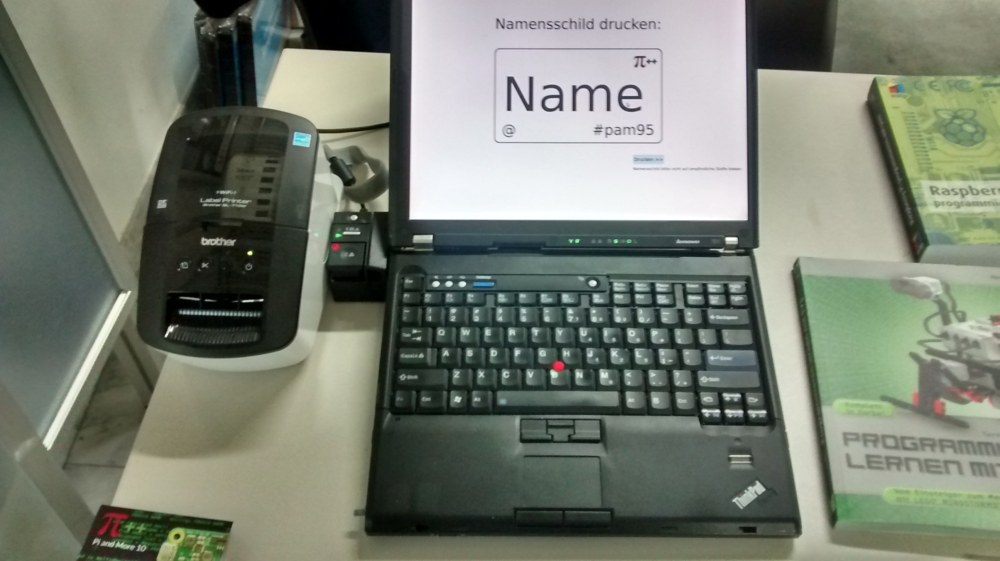

# Badgeprinter

Mit Hilfe eines Etikettendruckers vom Typ "Brother QL-710" oder
"Brother QL-710W" können individuelle Namensschilder gedruckt werden, die sich
die Teilnehmer einer Konferenz oder Messe auf das Hemd kleben können.

## Installation

Zunächst muss ein Etikettendrucker unter dem Namen ``Brother_QL-710W`` im 
Betriebssystem installiert werden.

In der Datei ``view.qml`` kann das Hashtag geändert werden.

Das Logo befindet sich in der Datei ``logo-small.png`` und kann dort angepasst
werden.

## Start

Das Programm kann dann gestartet werden.

    python badgeprinter.py
