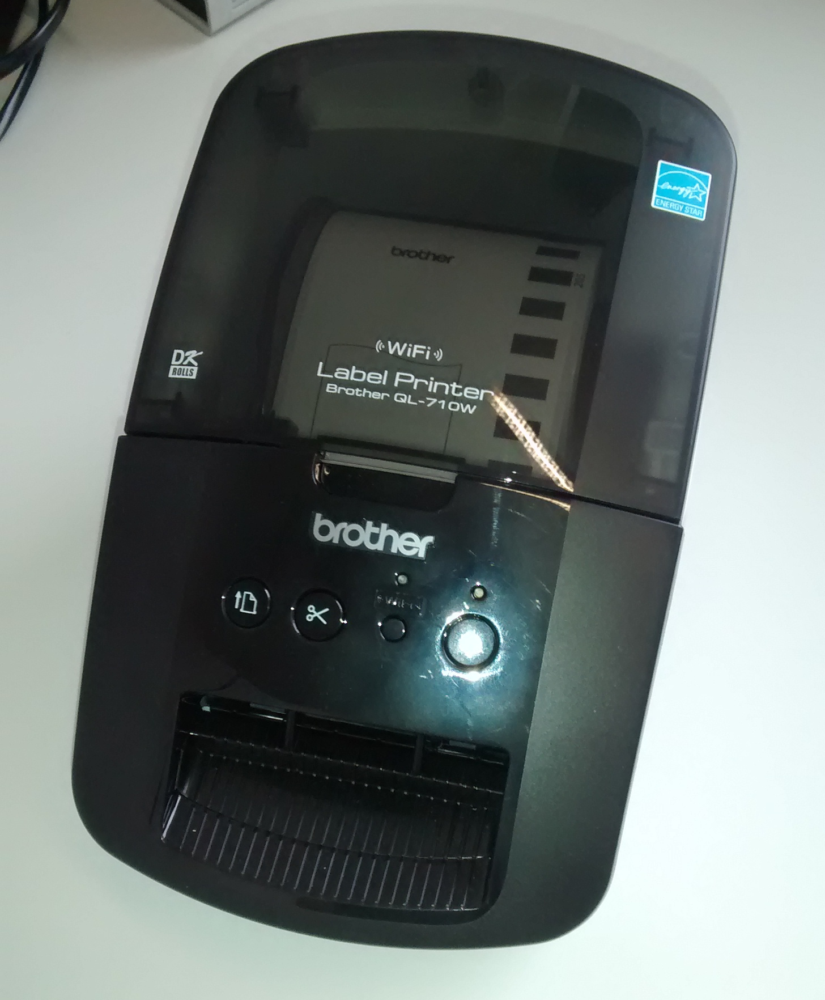

# Badgeprinter

Mit Hilfe eines Etikettendruckers vom Typ "Brother QL-710" oder
"Brother QL-710W" können individuelle Namensschilder gedruckt werden, die sich
die Teilnehmer einer Konferenz oder Messe auf das Hemd kleben können.

## Installation

Zunächst muss ein Etikettendrucker unter dem Namen ``Brother_QL-710W`` im 
Betriebssystem installiert werden.

Es werden PySide für die grafische Oberfläche und die "Python Imaging
Library" (PIL) benötigt, welche über den Paketmanager installiert
werden können. Das Paket ImageMagick wird für die Konvertierung des
Bildmaterials benötigt.

    $ sudo apt install python3-pyside python3-pil imagemagick

In der Datei ``config.ini`` findet die Konfiguration statt. Dort
können das Hashtag oder der Name der Logo-Datei geändert werden.

Verschiedene Logos befinden sich im Verzeichnis ``logos`` und werden
jeweils durch einem symbolischen Link ``logo-small.png`` referenziert.

## Start

Das Programm kann dann gestartet werden.

    $ python badgeprinter.py

Mit Alt-F4 kann es wieder beendet werden.

## Danke

Das Projekt beruht auf dem [badgeprinter-Projekt der
PiAndMore-Konferenz](https://github.com/PiAndMore/badgeprinter). Danke
für die Vorarbeiten.